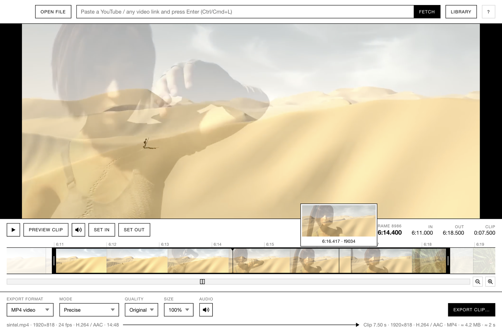

<p align="center">
  <picture>
    <source media="(prefers-color-scheme: dark)" srcset="docs/wordmark-dark.gif" />
    
  </picture>
</p>

<h1 align="center">Herr Schneider</h1>

<p align="center">All-in-one video downloader and clipper for macOS, Windows and Linux.<br />
Paste a link or drop a file. Mark in and out. Export.</p>

<p align="center">
  
</p>

## Features

- Drop in any file, or paste in a [yt-dlp](https://github.com/yt-dlp/yt-dlp)-compatible video link
- Downloaded files remain in your library to clip or manage anytime
- Easily re-encode, scale, or convert to animated GIF

## Download

Installers for macOS, Windows and Linux are on the [Releases](https://github.com/alancwoo/Herr-Schneider/releases) page. The macOS build is signed and notarized.

## Run

```
npm install
npm start
npm start -- path/to/video.mp4
npm start -- "https://youtu.be/…"
```

ffmpeg and ffprobe are bundled. yt-dlp is used from your PATH if present, otherwise downloaded automatically on first fetch. Override any of them with `CLIPPERRR_FFMPEG`, `CLIPPERRR_FFPROBE`, `CLIPPERRR_YTDLP`.

## Build

```
npm run dist:mac      # .dmg, arm64 + x64
npm run dist:win      # NSIS installer + portable .exe
npm run dist:linux    # AppImage + .deb
```

Installers land in `dist/`. On a Mac with a "Developer ID Application" certificate in the keychain, `dist:mac` signs automatically; add `APPLE_ID`, `APPLE_APP_SPECIFIC_PASSWORD` and `APPLE_TEAM_ID` to the environment and pass `-c.mac.notarize=true` to notarize as well.

To publish a release for all three platforms, push a version tag and GitHub Actions builds, signs, notarizes and attaches them (secrets are listed in `.github/workflows/release.yml`):

```
npm version 0.1.0
git push origin main --tags
```

## Keyboard

| Key | Action |
| --- | --- |
| Space | Play / pause |
| P | Preview the clip |
| M | Mute / unmute |
| ← → | One frame (Shift: 1 s, Alt: 5 s) |
| , . | One frame (Shift: 10 frames) |
| I / O | Set in / out at the playhead |
| [ ] | Jump to in / out |
| Z / Shift+Z | Zoom to selection / reset |
| Ctrl/Cmd+O | Open file |
| Ctrl/Cmd+L | Open link |
| Ctrl/Cmd+B | Library |
| Ctrl/Cmd+S | Export |
| ? | All shortcuts |

## The name

The full name is *Herunterladschneidausgeber*: download-cut-exporter. Strike out the spare letters and what remains is **Herr Schneider**, Mr. Cutter.

Fetched videos live in the app data folder (`~/Library/Application Support/herunterladschneidausgeber/sources` on macOS, `%APPDATA%\herunterladschneidausgeber\sources` on Windows, `~/.config/herunterladschneidausgeber/sources` on Linux).

MIT. Built on Electron, ffmpeg and yt-dlp.
